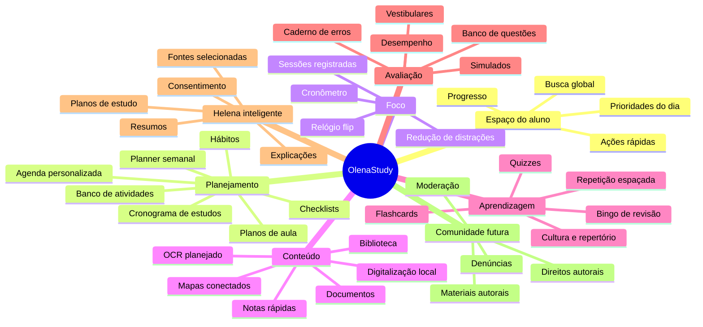
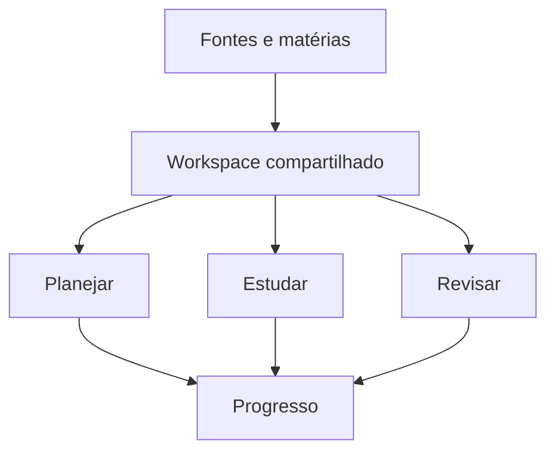

# Mapa mental do OlenaStudy

Este mapa registra a visão do produto sem afirmar que recursos planejados já estão disponíveis. O
estado executável de cada módulo fica tipado em `src/product/module-catalog.ts`.

## Princípio de integração

Os módulos não serão aplicativos isolados dentro do aplicativo. Matérias, fontes, tarefas,
sessões, documentos, questões e revisões devem compartilhar o mesmo workspace. Uma questão errada
pode criar uma revisão; uma revisão pode entrar no planner; uma fonte pode alimentar uma anotação,
um quiz ou um mapa de conteúdo; uma sessão de foco pode registrar progresso na mesma meta.

## Estados

- **Disponível:** existe fluxo funcional, persistência local e testes.
- **Fundação:** existe contrato técnico ou domínio, mas não uma promessa ativa na interface.
- **Planejado:** consta no mapa e no roadmap, sem botão que simule funcionalidade.

O catálogo de produto é a referência para os estados. A documentação detalha intenção; a interface
só oferece ações que funcionam.
