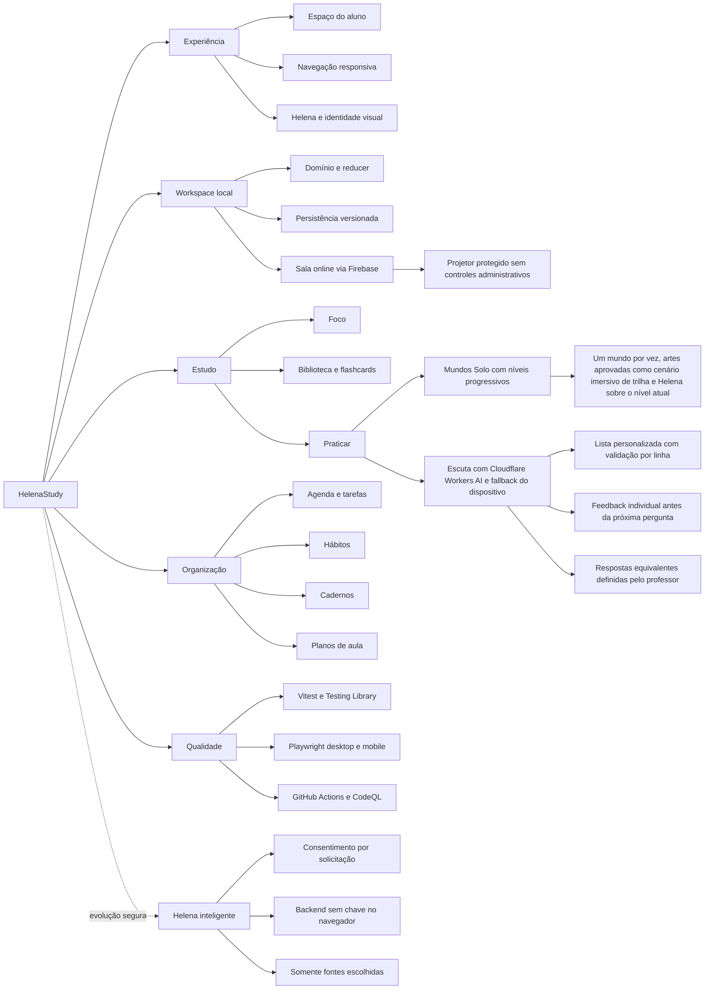

# HelenaStudy: Second Brain

## Preferências de estudo

O onboarding coleta modalidades, organização, ritmo e interesse em programação. Esses dados vivem
no workspace local e podem ser corrigidos no Perfil. Eles são preferências editáveis, não um
diagnóstico. A evolução planejada está em `STUDY_PREFERENCES_ROADMAP.md`.

O rail desktop usa papel creme e texto grafite no claro, papel grafite e texto creme no escuro. O Espaço do aluno não renderiza a antiga mascote do cartão inicial.

No celular, Mais fica no cabeçalho ao lado do seletor de aparência e da foto circular. `MobileMenuContext` conecta esse acionador à gaveta; o quinto item inferior, Perfil, usa ícone próprio e fica desabilitado, reservado para configurações futuras de perfil, conta e aplicativo. O seletor de aparência é compartilhado com o desktop. Regressões de recorte e navegação são verificadas em `e2e/responsive-navigation.spec.ts`.

Configuração e modelo de ameaça do login Google: GOOGLE_LOGIN.md. O resumo abre uma etapa de autenticação com preparação antecipada do SDK.

## Onboarding de prévia e padrão visual

Consultar DESIGN_SYSTEM.md para papel recortado, marca e loading compartilhado. /?onboarding=1 abre a experiência aprovada; ainda não é uma barreira de entrada automática. Google Auth é independente da integração com Google Agenda. Estado atual, riscos e requisitos de configuração em CURRENT_STATE_AUDIT.md.

## Ícones de navegação, 14/09/2026

`NavigationIcon` carrega SVGs autorais de papel recortado em `public/navigation-icons/paper/{claro,roxo,escuro}/`.
Preservar as três variantes: roxo é um estado contextual real, não um terceiro tema.
Novos ícones devem ter viewBox 0 0 48 48, margem interna, fundo transparente e formas reconhecíveis em 24px.
Os SVGs de utilidades e a iconografia aprovada da sala são independentes desta família.

## Decisões do Modo Sala, 12/09/2026

A limpeza passou a processar múltiplos lotes com prazo de 45 segundos, timeout de
rede e indicação explícita de backlog. O CI da PR #98 validou Chromium/WebKit;
isso não substitui a validação física nem ativa App Check/cron em produção.

- Firebase REST usa ETags/CAS, revisões públicas monotônicas e recibos para operações repetidas; não há bloqueio apenas em memória no servidor de produção.
- Sessão temporária possui credencial privada distinta do ID exibido. Presença usa heartbeat e encerra após 2 minutos sem anfitrião; sala tem prazo absoluto de 4 horas.
- Quiz e bingo compartilham rodada, equipes, prévia e seleção de material. Flashcards pessoais selecionados são compartilhados temporariamente, com aviso na interface.
- O lobby flat mantém a arte aprovada da Helena no convite, usa os ícones existentes e apresenta atividades futuras desabilitadas. Somente Escuta coletiva e Bingo iniciam rodadas.
- O Quiz de Escuta prioriza uma lista personalizada de até 30 pares, aceita separadores comuns, explica erros por linha e não expõe a palavra na tela projetada. A resposta privada inclui correção, par esperado e XP por três segundos. A sala sincroniza limite de repetições, velocidade e reprodução automática.
- O Modelo pronto contém somente cinco palavras. A base local de 10 mil frequências e seu gerador Python foram removidos; classificação fora da sala usa cache, Datamuse e estimativa offline.
- SDK Firebase App Check é importado dinamicamente apenas se configurado. JWT é verificado com jose no servidor; configuração externa ainda pendente, sem enforcement ativo declarado.
- Limpeza autenticada diária em `api/room-cleanup.ts` depende de CRON_SECRET e regras/índices em `firebase-room.rules.json`. Não publicar as regras sem considerar salas legadas sem expiresAt.
- `npm run verify` reúne lint, formatação, testes, build e orçamento. `PLAYWRIGHT_SYSTEM_EDGE=1` permite validar com Edge local quando os browsers Playwright não estão disponíveis; CI mantém Chromium/WebKit. E2E multiplayer usa transportes de teste, não produção.
- Estado e pendências detalhados em `CURRENT_STATE_AUDIT.md` e procedimento em `ROOM_SETUP.md`.

## Proposta

O HelenaStudy é o segundo aplicativo da marca Oli. Ele reúne organização, foco, rotina e
aprendizado em um único espaço, preservando o planejador de aulas de inglês como uma ferramenta do
produto.

**Promessa:** Estude, organize e avance com a Helena.

## Público inicial

- estudantes que desejam organizar rotina e matérias;
- professores de inglês e professores particulares;
- pessoas que precisam reunir tarefas, foco, hábitos e anotações.

## Fluxo atual

1. Consultar tarefas, agenda, hábitos e minutos de foco no Espaço do aluno.
2. Criar matérias, tarefas e compromissos na Agenda.
3. Registrar sessões no cronômetro de Foco.
4. Criar e marcar Hábitos diários.
5. Escrever, desenhar ou anexar uma digitalização nos Cadernos.
6. Guardar links, textos e flashcards por matéria na Biblioteca.
7. Revisar flashcards, responder Quizzes, completar Bingos e acompanhar metas em Praticar.
8. Praticar escuta em rodadas curtas com voz natural (Cloudflare Workers AI) e fallback do dispositivo.
9. Criar uma Sala online e sincronizar lobby e rodada entre dispositivos.
10. Montar planos de aula pelo fluxo determinístico existente.

Os dados pessoais compartilham um workspace local versionado e não exigem conta. O Modo Sala usa
Firebase Realtime Database para estado temporário compartilhado; o texto da pergunta de escuta é
enviado ao Cloudflare Workers AI apenas quando a voz neural é usada, tanto no Quiz de Escuta
individual quanto no Modo Sala.

## Arquitetura atual

- React 19 e TypeScript estrito;
- Vite para desenvolvimento e build;
- CSS próprio, mobile-first e Manrope carregada pelo Google Fonts;
- interface com hierarquia de próxima ação, cartões de progresso, ícones ilustrados preenchidos e
  movimentos curtos compatíveis com `prefers-reduced-motion`;
- Vitest e Testing Library para unidade/componente;
- Playwright para fluxos desktop e mobile;
- GitHub Actions para qualidade, auditoria, segredos, análise estática e CodeQL.
- Cloudflare Workers AI (modelo MeloTTS) chamado por função same-origin, sem expor o token no
  navegador; serviço próprio Kokoro+Piper (`services/tts`) implementado e testado, mas fora de uso
  em produção por falta de hospedagem grátis viável;
- cache de áudio por texto e velocidade durante a sessão, com fallback imediato para a voz do
  dispositivo se o Cloudflare Workers AI falhar;
- Firebase Realtime Database como armazenamento temporário da Sala e Server-Sent Events para o
  estado público realtime;
- credenciais temporárias da Sala ficam em `sessionStorage`, permitindo retomar a atividade após
  recarregar a aba sem duplicar participantes.

## Mapa mental vivo

Este diagrama funciona como a rede de navegação do repositório: parte da experiência HelenaStudy e
liga cada área do produto à sua base técnica e às garantias de qualidade.

Ao alterar uma área, atualize o nó correspondente e os fluxos ligados a ele. Detalhes de produto
continuam em [`PRODUCT_MIND_MAP.md`](PRODUCT_MIND_MAP.md); este mapa serve como visão executiva do
sistema completo.

## Decisão de produto: rodada de escuta e projeção

A duração exibida soma o tempo de resposta e três segundos de feedback por pergunta. Quando todas
as pessoas conectadas respondem, o resultado fica visível por esse intervalo e uma barra mostra o
avanço. Respostas enviadas ficam bloqueadas até a confirmação do servidor e usam o loading compacto
da Helena. A reprodução automática aguarda o fim de “3, 2, 1, Vai!”. A repetição manual do áudio tem
cooldown de cinco segundos, comunicado no próprio botão.

O professor pode cadastrar equivalências com `|`. A normalização ignora caixa, acentos, pontuação e
espaços excedentes. Uma opção desligada por padrão permite aceitar uma inserção, remoção ou troca de
caractere em respostas com pelo menos quatro caracteres. Assim, a aproximação só entra por decisão
explícita do professor.

O backend conserva as alternativas no baralho privado. O fim do baralho entra no estado de resultados,
sem encerrar a sala. O anfitrião pode repetir a atividade, voltar ao lobby para trocar a configuração ou
encerrar a sala; participantes permanecem na mesma sessão enquanto aguardam a escolha.

O modo projetor vive em `/sala/<código>/projetor`, reutiliza a sessão temporária do anfitrião e não
expõe ações de revelar, avançar ou encerrar. O QR code continua usando a composição aprovada da Helena.

## Etapas do produto

1. **Núcleo local concluído:** Espaço do aluno, Agenda, Foco, Hábitos, Cadernos e planos de aula.
2. **Sistema de estudos em evolução:** biblioteca, flashcards, revisão programada, quizzes, bingo,
   metas, digitalização local e escrita à mão estão funcionais. OCR e banco de questões ainda não.
3. **Helena inteligente com fundação definida:** contrato, consentimento e fronteira segura do
   backend estão prontos; provedor e interface ainda não estão ativados. Depois entram tutor,
   explicações, resumos e planos personalizados.
4. **Aplicativo mobile:** notificações, sincronização e controle nativo de tempo de tela.

As etapas 2 a 4 entram em mudanças próprias. IA e armazenamento remoto exigem consentimento,
modelo de ameaça e documentação do fluxo de dados. O bloqueio de outros aplicativos não deve ser
simulado em uma aplicação web.

A definição do backend de IA está em [`AI_BACKEND.md`](AI_BACKEND.md). O contrato envia somente
fontes escolhidas pela pessoa e exige consentimento a cada solicitação. Nenhuma chave pode existir
no bundle do navegador.

## Identidade

- preto: `#17151C`;
- amarelo: `#FFC94A`;
- violeta: `#7257E8`;
- lavanda: `#E9E2FF`;
- creme: `#FFF8ED`.

Helena é a gata preta de olhos amarelos que orienta o fluxo. O aplicativo usa a silhueta
assimétrica original em `public/helena.svg`, sem redesenhar a personagem como um gato genérico. O
nome exibido na interface é somente HelenaStudy. A navegação usa uma família própria de ícones SVG
lineares, com selos amarelos e traços pretos para manter contraste e consistência sem carregar um
pacote de ícones adicional.

## Fora do escopo desta fase

- login e cadastro;
- banco de dados e colaboração;
- geração por IA;
- upload e leitura automática de PDF/livros;
- pagamentos;
- exportação final em PDF ou slides;
- acompanhamento de alunos;
- bloqueio de outros aplicativos;
- notificações nativas.

Cada item entra apenas quando o fluxo local básico estiver validado.

O mapa completo do produto está em [`PRODUCT_MIND_MAP.md`](PRODUCT_MIND_MAP.md), e a ordem de
implementação com critérios técnicos está em [`IMPLEMENTATION_ROADMAP.md`](IMPLEMENTATION_ROADMAP.md).

# Decisão de interface: navegação lateral

O menu lateral concentra a troca de módulos no desktop. O Espaço do aluno não repete essa lista:
mantém apenas ações contextuais e o resumo do dia. Em telas móveis, a barra inferior e a gaveta
esquerda “Mais ferramentas” preservam o acesso completo. A barra inferior usa grafite no tema claro
e branco no tema escuro. Itens ativos e o menu aberto usam papel roxo facetado com ícones creme,
transições curtas entre módulos e respeito à preferência de movimento reduzido do sistema.

# Entrada do aplicativo

App verifica helena.onboarding.v1 para apresentar o onboarding na primeira visita. GoogleLogin registra a conclusão após login bem-sucedido e guarda nome e foto Google em helena.profile.v1 para o perfil do cabeçalho. A mesma chave guarda a escolha entre os avatares oficiais Poliana, Oliver, Andreyna, Jairo e Helena. O parâmetro onboarding permite revisar o fluxo. Links de sala preservam acesso direto.
